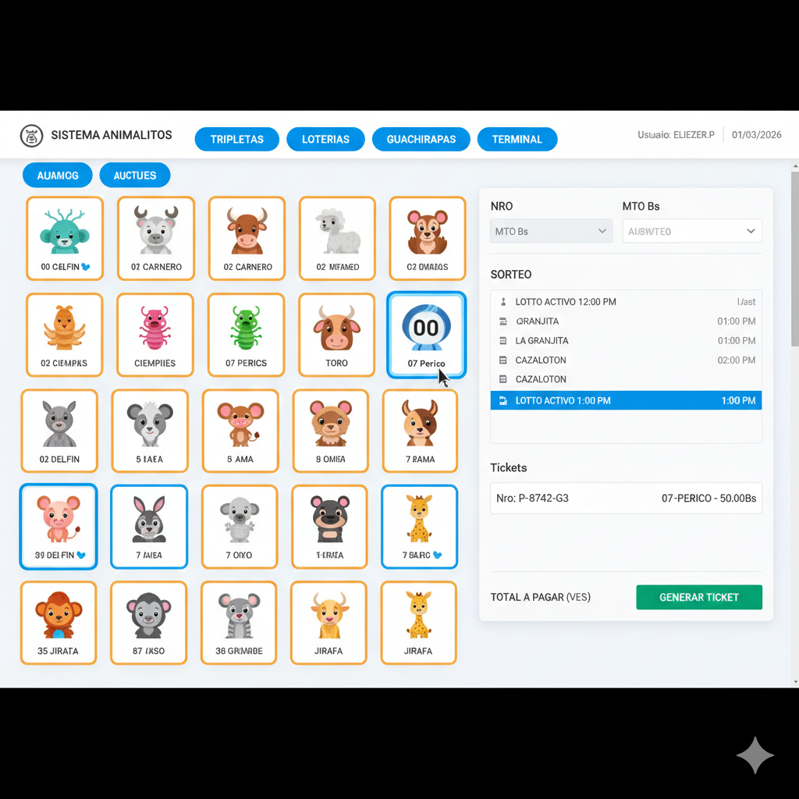
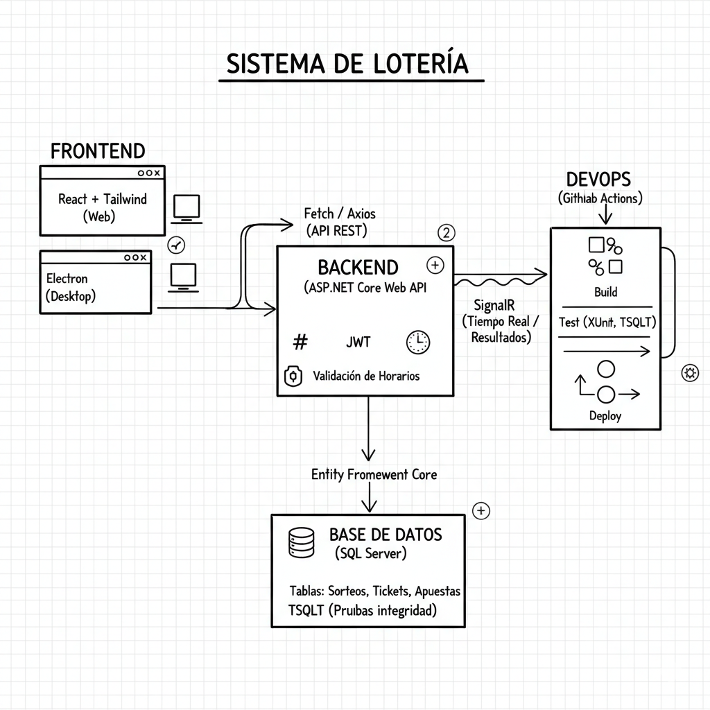
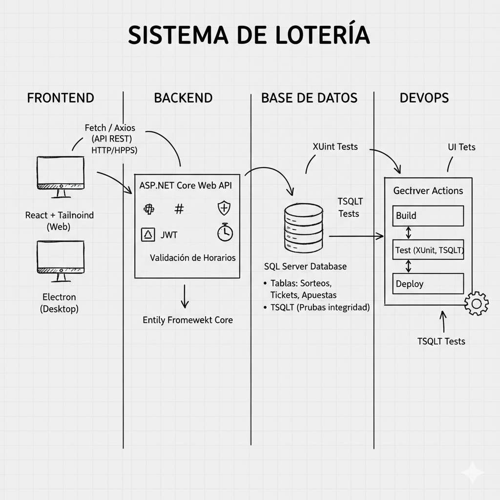

# 🚀 Sistema de Gestión de Loterías y Apuestas (Animalitos)

Este proyecto tiene como objetivo desarrollar un sistema integral para la gestión de apuestas de loterías de "Animalitos", ofreciendo una plataforma robusta y escalable tanto para operadores como para usuarios finales. Se enfoca en la eficiencia, seguridad y una experiencia de usuario intuitiva.

Inspirado en sistemas como Lotto Activo, La Granjita, Lotipos y PremierPlus, este proyecto es un desafío técnico que combina interfaces dinámicas, lógica de negocio estricta y seguridad transaccional.

# 🎯 Demo (Proximamente)

**Aquí va un enlace a una demo funcional una vez que tenga algo tangible.**

Visualización esperada:

* Acceso con credenciales.

* Selección de animales/números.

* Confirmación de apuesta y generación de ticket.

* Consulta de resultados.

# 🖥️ Pantalla Principal: Terminal de Ventas

La pantalla principal está diseñada para ser una Single Page Application (SPA) donde el operador realiza todo el ciclo de venta sin recargar la página.

**Campos Activos y su Función:**

* Panel de Selección (Grid):

* Una cuadrícula con los 36 o 38 animales. Al hacer clic, el animal se resalta y se añade a la lista de apuesta actual.

* Selector de Sorteos:

* Un menú lateral o superior donde aparecen los sorteos disponibles (Ej: Lotto Activo 10:00 AM, La Granjita 11:00 AM). El sistema debe mostrar cuáles están abiertos y cuáles cerrados según la hora del servidor.

* Campo de Monto (Input):

* Donde se ingresa el valor de la apuesta en Bolívares. Debe tener validación para no permitir montos negativos.

* Lista de Apuesta (Bet Slip):

* Un resumen a la derecha que muestra los animales seleccionados, el monto por cada uno y el Total a Pagar.

* Botón "Generar Ticket" / "Imprimir":

* Este botón dispara el POST hacia tu API en C#. Si la respuesta es exitosa, se genera el serial del ticket y se activa el comando de impresión.

Captura de pantalla de la interfaz principal:
`


# 🛠️ Tecnologías Utilizadas

Este proyecto se construye sobre un stack tecnológico moderno y robusto:

# Frontend

* **React:** Para una interfaz de usuario dinámica y componentes reutilizables.

* **HTML5:** Estructura semántica de la aplicación.

* **Tailwind CSS:** Para un diseño utilitario y responsivo, agilizando el desarrollo de la UI.

* **JavaScript (ES6+):** Lógica interactiva del lado del cliente.

* **Fetch API:** Para la comunicación asíncrona con el backend.

* **Metodología:** Mobile-first design.

# Backend
 
* **C# con ASP.NET Core Web API:** Para construir un API RESTful robusta, escalable y de alto rendimiento.

* **Entity Framework Core:** ORM para una gestión eficiente y tipada de la base de datos.

* **SQL Server:** Base de datos relacional para almacenamiento de datos transaccionales.

* **SignalR:** Para comunicación en tiempo real (ej. actualización de resultados de sorteos).

* **Pruebas y CI/CD**

* **XUnit:** Framework de testing para pruebas unitarias en C#.

* **TSQLT:** Framework para pruebas unitarias en SQL Server, garantizando la integridad de la base de datos.

* **GitHub Actions:** Para integración y despliegue continuo (CI/CD), automatizando el pipeline de desarrollo.

# 🧠 Conceptos Técnicos Aplicados

Este proyecto es un laboratorio para la aplicación de conceptos avanzados de desarrollo:

# Frontend (React)

* **Componentización y Manejo de Estado:** Gestión eficiente de la UI y el flujo de datos de apuestas utilizando React Hooks (useState, useReducer, useEffect).

* **CSS Grid y Flexbox:** Diseño de la cuadrícula de animales y la distribución de la interfaz para una experiencia responsiva.

* **Validación de Formulario:** Lógica de validación del lado del cliente para una UX fluida.

* **Backend (C# & .NET Core)**

* **API RESTful:** Diseño e implementación de endpoints REST siguiendo las mejores prácticas.

* **Inyección de Dependencias (DI):** Gestión de servicios y componentes en ASP.NET Core.

* **Lógica de Negocio:** Implementación de reglas estrictas para la validación de apuestas (horarios de sorteo, límites, etc.).

* **Gestión de Transacciones:** Asegurar la atomicidad y consistencia de las operaciones en la base de datos.

* **Seguridad:** Implementación de autenticación y autorización (JWT), y validación de datos.

* **Base de Datos (SQL Server)**

* **Diseño de Esquema:** Creación de tablas optimizadas para apuestas, sorteos, usuarios y transacciones.

* **Integridad Referencial:** Uso de claves foráneas para mantener la consistencia entre las tablas.

* **Procedimientos Almacenados y Funciones:** Optimización de operaciones complejas y lógica de negocio a nivel de base de datos.

* **Pruebas de Integridad:** Utilización de TSQLT para asegurar que la lógica de la base de datos funciona como se espera.

# DevOps

* **CI/CD con GitHub Actions:** Automatización de la construcción, prueba y despliegue del frontend y backend.

# 🏗️ Arquitectura del Sistema

La arquitectura del sistema se basa en un modelo cliente-servidor con una API robusta y una base de datos centralizada.

**Fragmento de código**

graph TD

    A[Cliente Web/Escritorio (React)] -->|HTTP/HTTPS (Fetch)| B(ASP.NET Core Web API)

    B -->|Entity Framework Core| C[SQL Server Database]
    
    B -->|SignalR| A
    
    C -- "TSQLT Tests" --> D[GitHub Actions]
    
    B -- "XUnit Tests" --> D
    
    A -- "UI Tests" --> D
    
Diagrama de Arquitectura (Excalidraw):


Diagrama de Base de Datos (Dbdiagram):


# 📋 Funcionalidades Clave a Programar

El sistema soportará las siguientes características principales:

# Gestión de Sorteos:

* Registro y configuración de diferentes tipos de sorteos (ej. "Lotto Activo", "La Granjita").

* Definición de horarios de cierre y apertura de apuestas por sorteo.

* Carga y publicación de resultados de sorteos.

# Módulo de Apuestas (Frontend):

* Interfaz intuitiva para la selección de "Animalitos" o "Tripletas".

* Ingreso de montos de apuesta y cálculo automático de premios potenciales.

* Generación de tickets de apuesta con serial único.

* Funcionalidad de impresión de tickets (simulada o real).

# Gestión de Usuarios y Roles:

* Registro y autenticación de usuarios (operadores, administradores).

* Roles con permisos diferenciados (ej. un operador solo puede vender, un administrador puede configurar sorteos).

# Reportes y Estadísticas:

* Consulta de ventas por sorteo, por día, por operador.

* Reportes de ganancias y pérdidas.

# Seguridad Transaccional:

* Validación en tiempo real de horarios de sorteo para evitar apuestas fuera de tiempo.

* Manejo de la integridad de los datos de las apuestas y los resultados.

# 🧠 Metodología de Trabajo y Herramientas

Para la organización y ejecución de este proyecto, se utilizarán las siguientes herramientas y metodologías:

### Gestión de Proyectos:

* **Notion:** Para la organización general del proyecto, documentación de requisitos, decisiones de diseño y seguimiento de la visión global.

* **Jira:** Para la gestión ágil de tareas, sprints, asignación de actividades y seguimiento del progreso del desarrollo (Scrum/Kanban).

### Diseño y Prototipado:

* **Figma:** Para el diseño de la interfaz de usuario (UI/UX), prototipos interactivos y mockups.

* **Excalidraw:** Para diagramas de arquitectura, flujos de usuario y conceptualización de ideas de diseño.

* **Dbdiagram.io:** Para el diseño y visualización del modelo de base de datos (diagramas Entidad-Relación).

### 📂 Instalación y Uso

1. **Clona el repositorio:**
   ```bash
   git clone [https://github.com/eliezerpolidor/LoteriAnimalitos.git](https://github.com/eliezerpolidor/LoteriAnimalitos.git)
   cd LoteriAnimalitos

2. **Configura el Backend (C#):**

* Navega a la carpeta src/Backend/SistemaLoteria.Api.

* Configura tu cadena de conexión a SQL Server en appsettings.json.

* Ejecuta las migraciones de Entity Framework Core: dotnet ef database update.

* Inicia la API: dotnet run.

* Configura el Frontend (React):

* Navega a la carpeta src/Frontend/sistema-loteria-ui.

3. **Instala las dependencias: npm install o yarn install.**

* Inicia la aplicación React: npm start o yarn start.

* Accede al sistema desde tu navegador en http://localhost:3000 (o el puerto que React use).

# 👨‍💻 Sobre mí
Soy Eliezer Polidor, Desarrollador Web con experiencia en la creación de soluciones creativas y eficientes. Apasionado por la tecnología y siempre en busca de nuevos desafíos para mejorar mis habilidades.

LinkedIn: CV Eliezer Polidor

Portafolio: Mi Portafolio

Notas para ti:

Reemplaza https://github.com/tu-usuario/sistema-loteria.git y https://tu-portfolio.com con tus enlaces reales.

Cuando tengas tus diagramas de Excalidraw y Dbdiagram, puedes exportarlos como imágenes (SVG es ideal para Markdown) y colocarlos en una carpeta docs/img o assets en tu repositorio, y luego enlazar esas imágenes en el README.md.

Asegúrate de que los enlaces a tu LinkedIn y Portafolio sean correctos.


